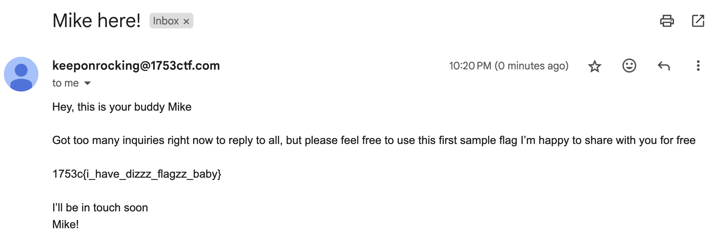

We are given a link to this website:


Looking at the source, the avatar is linked from gravatar.

```
https://www.gravatar.com/avatar/2471b1362bace767fdc0bb9c7e4df686?s=150```

Googling around, we see this: https://docs.gravatar.com/general/hash/ and the line `All URLs on Gravatar are based on the use of the hashed value of an email address.`

We can write a script to iterate over possible emails:

```py
import hashlib

with open("/Users/natem135/Downloads/rockyou.txt", "rb") as file:
    for line in file:
        word = line.strip()
        try:
            email = f"{word.decode()}@1753ctf.com"
            email_hash = hashlib.md5(email.encode()).hexdigest()
            #print(f"{email} {email_hash}")
            if email_hash == "2471b1362bace767fdc0bb9c7e4df686":
                print(f"Found email: {email}")
                break
        except:
            pass
```


```bash
natem135@Nathans-MBP ctf-writeups % python3 1753ctf24/misc/resume/script.py
Found email: keeponrocking@1753ctf.com
natem135@Nathans-MBP ctf-writeups % 
```

We can them email `keeponrocking@1753ctf.com` for the flag:




Flag: `1753c{i_have_dizzz_flagzz_baby}`