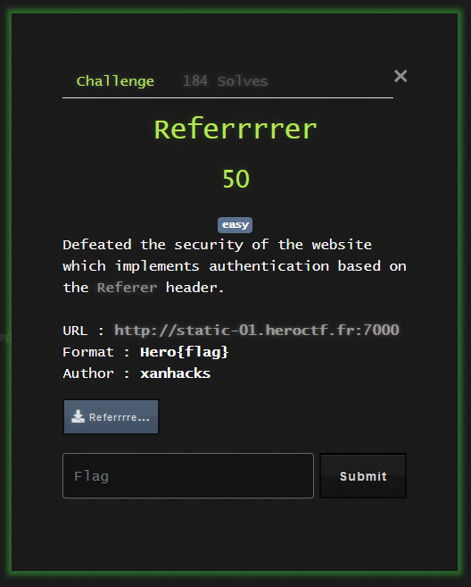

# Referrrrer



This is a simple challenge. There is a nginx server that proxies to an express server. Both the nginx server and express server require different referrer values, based on the following given configs:

```
worker_processes auto;

events {
    worker_connections 128;
}

http {
    charset utf-8;

    access_log /dev/stdout;
    error_log /dev/stdout;

    upstream express_app {
        server app:3000;
    }

    server {
        listen 80;
        server_name example.com;

        location / {
            proxy_pass http://express_app;
            proxy_set_header Host $host;
            proxy_set_header X-Real-IP $remote_addr;
        }

        location /admin {
            if ($http_referer !~* "^https://admin\.internal\.com") {
                return 403;
            }

            proxy_pass http://express_app;
            proxy_set_header Host $host;
            proxy_set_header X-Real-IP $remote_addr;
        }
    }
}
```

```
const express = require("express")
const app = express()


app.get("/", (req, res) => {
    res.send("Hello World!");
})

app.get("/admin", (req, res) => {
    if (req.header("referer") === "YOU_SHOUD_NOT_PASS!") {
        return res.send(process.env.FLAG);
    }

    res.send("Wrong header!");
})

app.listen(3000, () => {
    console.log("App listening on port 3000");
})
```

The trick here is that the nginx config specifically matches `/admin`, while the express page is not case sensitive. A request to `/aDmin` will not get caught up in the header check by nginx, so a request to `/aDmin` with the referer header `YOU_SHOULD_NOT_PASS!` will reveal the flag.

Flag: `Hero{ba7b97ae00a760b44cc8c761e6d4535b}`
