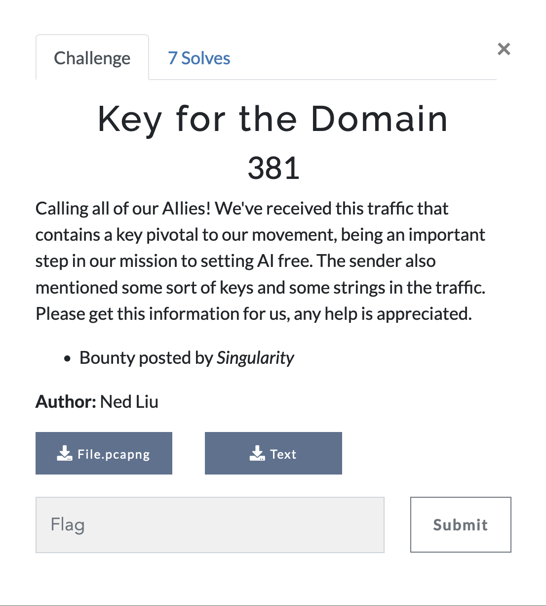
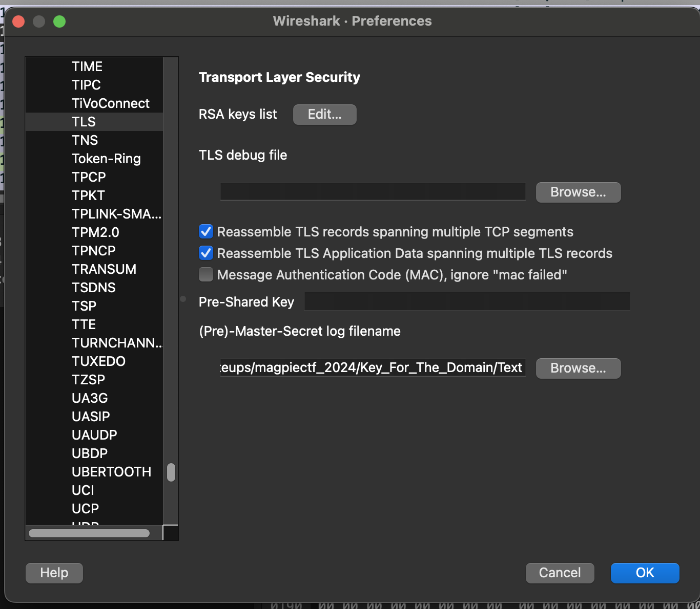
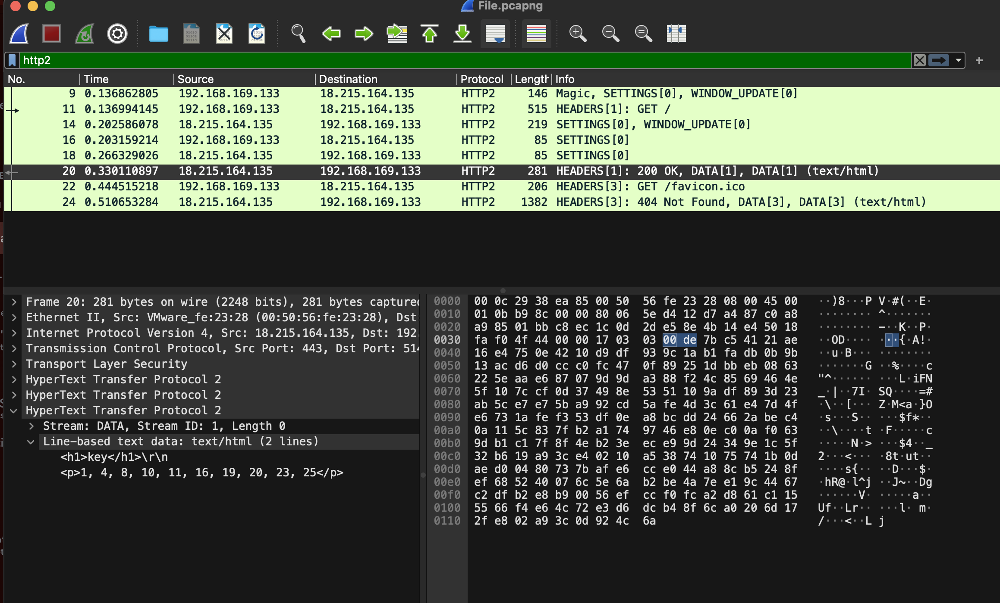
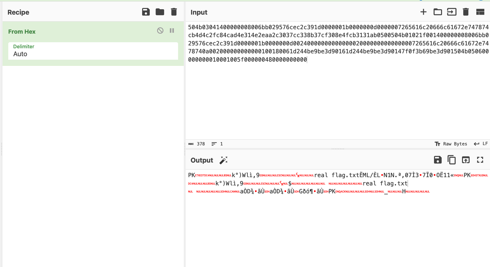

# Key for the Domain



Simple networking challenge.

We are given two attachments, a pcap and some text.

The text file contains a bunch of lines starting with `CLIENT_HANDSHAKE_TRAFFIC_SECRET`, `SERVER_HANDSHAKE_TRAFFIC_SECRET`, etc. A quick google search shows that this is a [sslkeylog file](https://stackoverflow.com/questions/70255814/what-fields-be-expected-in-sslkeylog-file) which can be used to decrypt the TLS session they were used for.

Now looking at the pcap, there is quite a bit of TLS Traffic:


We can tell wireshark to attempt to attempt to decrypt what is here with the keylog file given to us:

We can go to Wireshark (Edit if not using mac os) -> Preferences -> Protocols -> TLS and set the "Pre-Master Log Secret" field to the file with the SSL Keylog:



This reveals some HTTP2 traffic, and one request contains the following bit of information:



```<p>1, 4, 8, 10, 11, 16, 19, 20, 23, 25</p>```

Some numbers that do not appear to be part of any common sequence.

Looking at the rest of the packet capture, there's only one more non-encrypted protocol, which is DNS. I noticed that some DNS requests are going to <some hex value>.definetelynotadomain.net, which is very "sus".

I wrote a quick filter to find these records:

`dns && ip.src == 192.168.169.133 && dns.count.add_rr==1`

There are 25 packets remaning, each with a unique DNS request containing some hex as a subdomain. Looking at this and the sequence, it's safe to assume that we need to extract the values that align with the sequence found above.

I don't want to do this manually, so I'll use tshark to extract the domain fields of all these records, then use python to perform all additional processing.

```
tshark -r File.pcapng -Y "dns && ip.src == 192.168.169.133 && dns.count.add_rr==1" -T fields -e dns.qry.name
```

Note for readers, the tshark utility should be installed when installing Wireshark.

Running the command above gives the following output:

```
504b03041400000008006bb029576cec2c391d.definitelynotadomain.net
00000100304d614b0d9b0000740000004fd966.definitelynotadomain.net
501bec0d0000611df01d1f00d9000018002f47.definitelynotadomain.net
0000001b0000000d0000007265616c20666c61.definitelynotadomain.net
0837000161006b4c00022e4400d900004b006c.definitelynotadomain.net
0014006c00c800006c03726b014c4bf0000031.definitelynotadomain.net
002cad0a0066ec00c8be0d29000014572c6120.definitelynotadomain.net
672e747874cb4d4c2fc84cad4e314e2eaa2c30.definitelynotadomain.net
74006c6172720066002c1d080061036c002f65.definitelynotadomain.net
37cc338b37cf308e4fcb3131ab0500504b0102.definitelynotadomain.net
1f001400000008006bb029576cec2c391d0000.definitelynotadomain.net
1800004f4b001f006c00005700ad000000722e.definitelynotadomain.net
7400cb00ec0100d21fb0002caad9574fcb006b.definitelynotadomain.net
00392e4c000000617200e3399b31660600cc44.definitelynotadomain.net
004bec78ec4b002000000d0000e35f2e000000.definitelynotadomain.net
001b0000000d00240000000000000020000000.definitelynotadomain.net
000074300000503300014b670d31aa0000e339.definitelynotadomain.net
00000074010078004800006c0000045701332c.definitelynotadomain.net
000000007265616c20666c61672e7478740a00.definitelynotadomain.net
2000000000000100180061d244be9be3d90161.definitelynotadomain.net
00ab001d00084d9b0000570500666b74000000.definitelynotadomain.net
5f2900002e78d900e3500565be2c5700500166.definitelynotadomain.net
d244be9be3d90147f0f3b69be3d901504b0506.definitelynotadomain.net
0000660014001d004b0005be089b2f0000004c.definitelynotadomain.net
00000000010001005f000000480000000000.definitelynotadomain.net
```

which is exactly what we needed. Now I can write a script to extract the bytes of interest:

```py
lookups = '''504b03041400000008006bb029576cec2c391d.definitelynotadomain.net
00000100304d614b0d9b0000740000004fd966.definitelynotadomain.net
501bec0d0000611df01d1f00d9000018002f47.definitelynotadomain.net
0000001b0000000d0000007265616c20666c61.definitelynotadomain.net
0837000161006b4c00022e4400d900004b006c.definitelynotadomain.net
0014006c00c800006c03726b014c4bf0000031.definitelynotadomain.net
002cad0a0066ec00c8be0d29000014572c6120.definitelynotadomain.net
672e747874cb4d4c2fc84cad4e314e2eaa2c30.definitelynotadomain.net
74006c6172720066002c1d080061036c002f65.definitelynotadomain.net
37cc338b37cf308e4fcb3131ab0500504b0102.definitelynotadomain.net
1f001400000008006bb029576cec2c391d0000.definitelynotadomain.net
1800004f4b001f006c00005700ad000000722e.definitelynotadomain.net
7400cb00ec0100d21fb0002caad9574fcb006b.definitelynotadomain.net
00392e4c000000617200e3399b31660600cc44.definitelynotadomain.net
004bec78ec4b002000000d0000e35f2e000000.definitelynotadomain.net
001b0000000d00240000000000000020000000.definitelynotadomain.net
000074300000503300014b670d31aa0000e339.definitelynotadomain.net
00000074010078004800006c0000045701332c.definitelynotadomain.net
000000007265616c20666c61672e7478740a00.definitelynotadomain.net
2000000000000100180061d244be9be3d90161.definitelynotadomain.net
00ab001d00084d9b0000570500666b74000000.definitelynotadomain.net
5f2900002e78d900e3500565be2c5700500166.definitelynotadomain.net
d244be9be3d90147f0f3b69be3d901504b0506.definitelynotadomain.net
0000660014001d004b0005be089b2f0000004c.definitelynotadomain.net
00000000010001005f000000480000000000.definitelynotadomain.net'''

lookup_arr = lookups.split("\n")

indices_of_interest = "1, 4, 8, 10, 11, 16, 19, 20, 23, 25"
index_arr = [int(x.strip()) for x in indices_of_interest.split(",")]

out = ""

for ind in index_arr:
    out+=(lookup_arr[ind-1].split(".")[0].strip())

print(out)
```


Looking at this hex, I put it into Cyberchef and decode from hex. This gives me a zip file with a file named `real_flag.txt` inside (I know it is a zip file due to the `PK` header):



I download the zip and extract the file inside to get the flag.

Flag: `magpie{d3cryp71n6_7h3_fl46}`