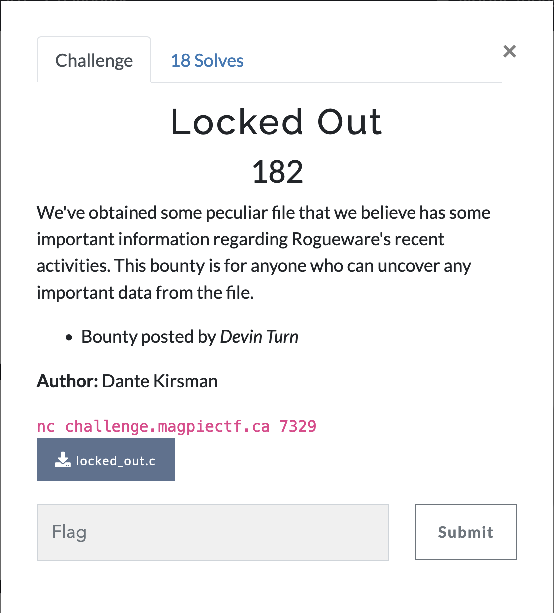
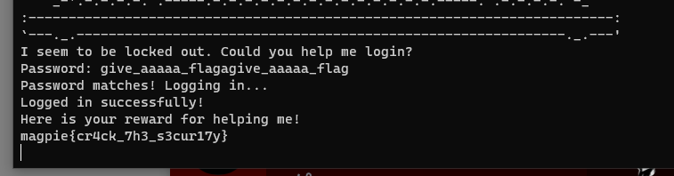

# Locked Out



pwn, simple buffer overflow

```
We've obtained some peculiar file that we believe has some important information regarding Rogueware's recent activities. This bounty is for anyone who can uncover any important data from the file.
```

Looking at the login function, there is a call to `gets()`.

```
int login() {
  char *pattern = "give_[a-z]{5}_flag";

  regex_t regex;
  if (regcomp(&regex, pattern, REG_EXTENDED) != 0) {
    fprintf(stderr, "Failed to compile regex\n");
    return 1;
  }

  char pass[PASSWORD_LENGTH];
  char input[PASSWORD_LENGTH];

  FILE *pass_file = fopen("pass.txt", "r"); 
  fgets(pass, PASSWORD_LENGTH, pass_file);  

  printf("Password: ");
  fflush(stdout);
  gets(input);
  ....
  ```

Our input goes in the input buffer of size `PASSWORD_LENGTH` which is 16. 

Next:

```
  if (regexec(&regex, pass, 0, NULL, 0) == 0) {
    printf("Password matches! Logging in...\n");
    regfree(&regex);
    return 1;
  }
```

The regular expression `give_[a-z]{5}_flag` is applied to the password buffer. If it passes the function returns 1.

Looking at where the `login` function is called:

```
  if (login()) {
    printf("Logged in successfully!\n");
    
    char flag[FLAG_LENGTH];
    FILE *flag_file = fopen("flag.txt", "r"); 
    fgets(flag, FLAG_LENGTH, flag_file);  

    printf("Here is your reward for helping me!\n%s", flag);
  } else {
    printf("Too many attempts. Please try again!");
  }
```

so all we need to do is get the pass buffer to match the regex.

Looking at the regex: `give_[a-z]{5}_flag`

We can easily write a string to match this: `give_aaaaa_flag`.

Looking at where the pass buffer was declared, it was done just before the input buffer:

```
char pass[PASSWORD_LENGTH];
char input[PASSWORD_LENGTH];
```

So we can fill the input buffer with 16 characters then place the correct string into the pass buffer to get the flag:



Flag: `magpie{cr4ck_7h3_s3cur17y}`