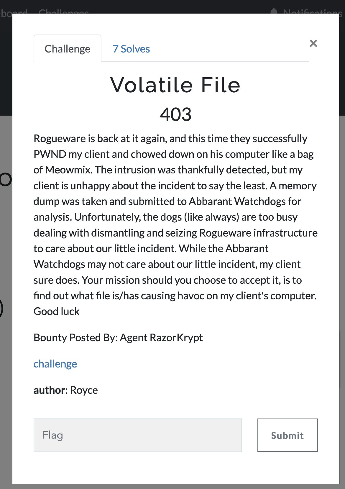

# Volatile File



We're given a memory dump that appears to come from a Windows 10 machine. I'll use Volatility to extract information and files to DNS.

I installed volatility3 and started analyzing the dump:

```
python3 vol.py -f /home/kali/Downloads/DESKTOP-MKUGUKD-2.raw windows.info
```

```
Variable        Value

Kernel Base     0xf80511407000
DTB     0x1aa000
Symbols file:///home/kali/ctf/magpie24/volatility3/volatility3/symbols/windows/ntkrnlmp.pdb/CA8E2F01B822EDE6357898BFBF862997-1.json.xz
Is64Bit True
IsPAE   False
layer_name      0 WindowsIntel32e
memory_layer    1 FileLayer
KdVersionBlock  0xf80512016368
Major/Minor     15.19041
MachineType     34404
KeNumberProcessors      2
SystemTime      2024-02-23 06:17:01
NtSystemRoot    C:\Windows
NtProductType   NtProductWinNt
NtMajorVersion  10
NtMinorVersion  0
PE MajorOperatingSystemVersion  10
PE MinorOperatingSystemVersion  0
PE Machine      34404
```

Next I looked at the process list:

```
python3 vol.py -f /home/kali/Downloads/DESKTOP-MKUGUKD-2.raw windows.pstree
```

There was one file that entry that stuck out:

```
**** 3884       2416    OfficeSetup.ex  0xb78fa9a2e080  0       -       1       False   2024-02-23 06:16:55.000000      2024-02-23 06:16:55.000000      \Device\HarddiskVolume2\Users\User\AppData\Roaming\TotallyLegitOfficeStartup\OfficeSetup.exe  
```

So process ID 3884 is suspicous here.

```
python3 vol.py -f /home/kali/Downloads/DESKTOP-MKUGUKD-2.raw windows.pslist
```

By looking at the pslist, I can see that the executable was run from powershell, and 4 seconds after it was run the memory dump was taken. This basically confirms that this specific executable is related to the flag.

The executable can be retrieved from the memdump:

```
python3 vol.py -vvv -f /home/kali/Downloads/DESKTOP-MKUGUKD-2.raw windows.pslist.PsList --pid 3884 --dump
```

My teammate took the leap of faith, ran the executable on their host machine, and got the flag:


Flag: `magpie{V0l4tiL3_C0d3_i5_H4rD}`