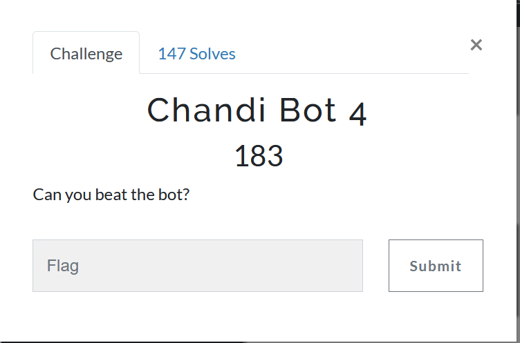
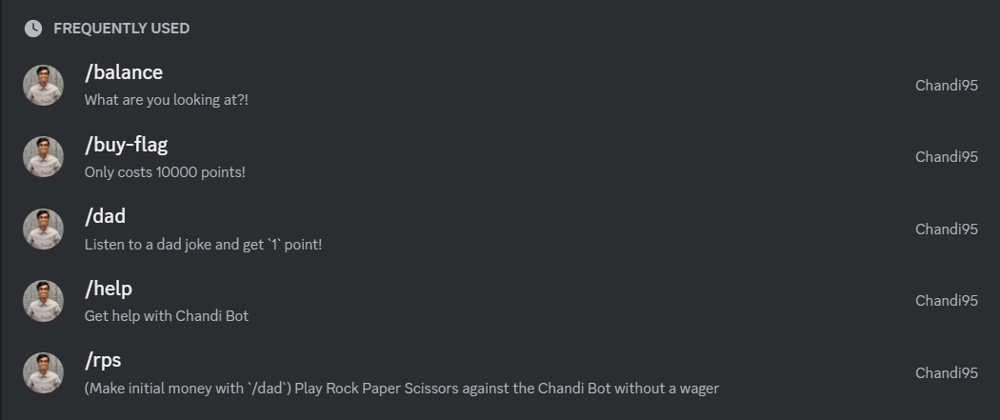
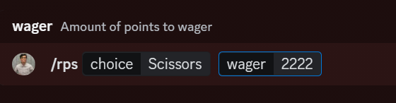

Looking at the bot on Discord, there are several slash commands:



Using `/dad`, I'm able to get one point and then I'm able to do RPS with a bet.

The goal is to buy the flag for 10,000 points. Self botting is against TOS and I would NEVER break TOS so there must be a different way to get around it.

Looking at the rps function, it takes in these params:



There is no validation on the wager. I am able to put in very large and very small numbers, including negative numbers.

If I were to lose, I could assume that the code would look like something like this:

```
bet = getInput
if balance < bet, return
balance = balance - bet
```

the problem is that the balance is an integer and there is no check for a negative numbers, so I can enter a large negative number. If I subtract 1 from the smallest value an integer can be, it will become the largest value an integer can be.

Using this, I am able to get the int limit as a balance and buy the flag:


Flag: `RS{TWO_NEGATIVES_DO_MAKE_A_POSITIVE}`
