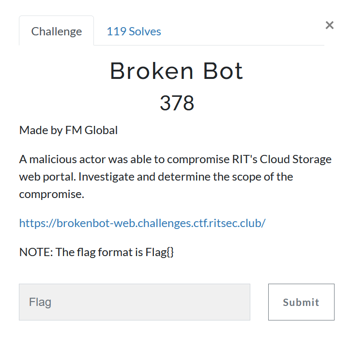
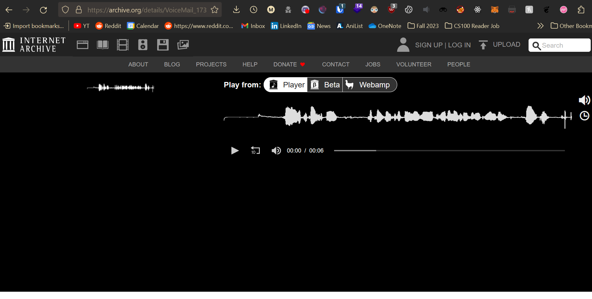
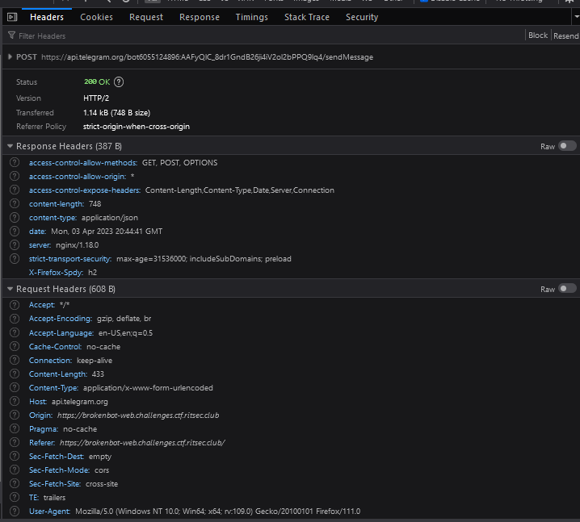
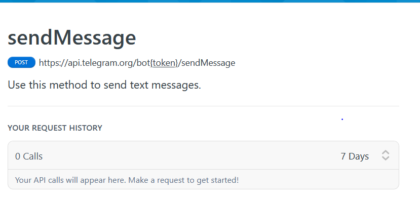
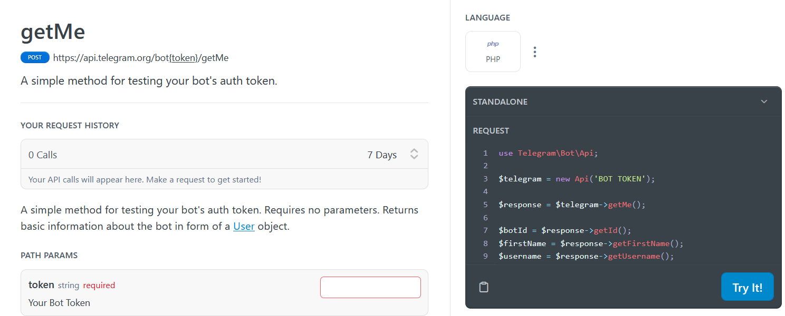
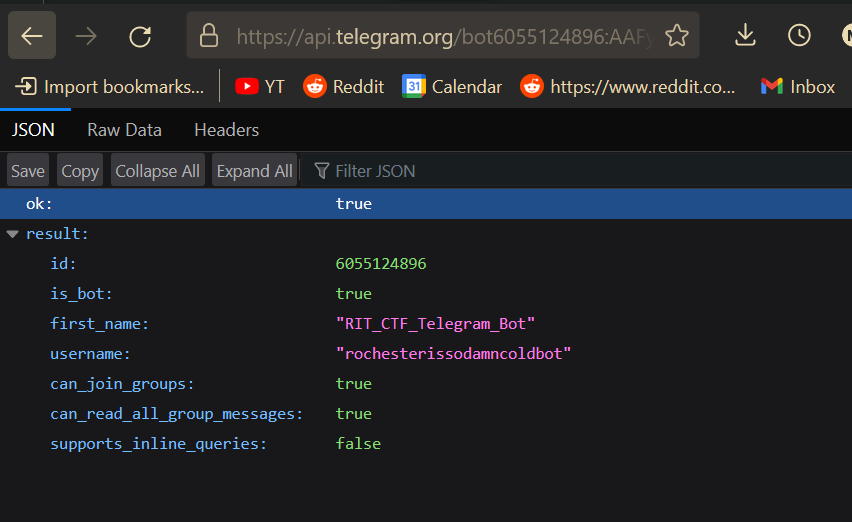
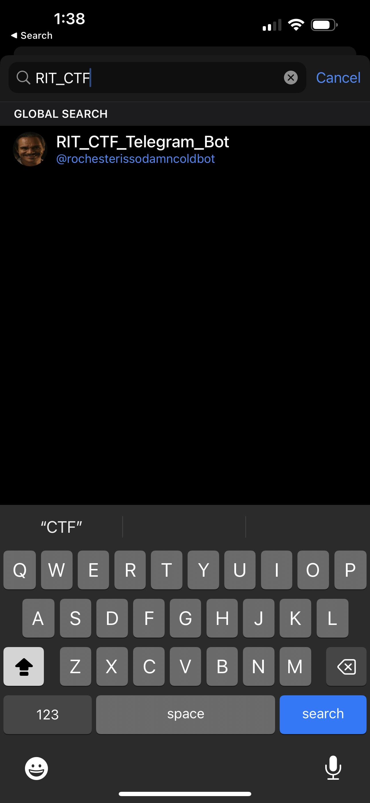
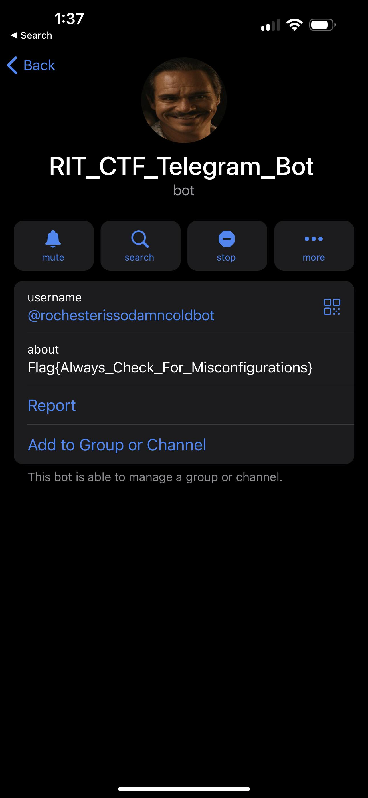

This challenge sends you to a website with a login page:

Upon entering any credentials, I am redirected to an archive.org webpage:

Taking a look at the network traffic when this happens, a post request is made to `api.telegram.com`.

After this happens, I am redirected.

I looked up the sendMessage api call and found this page:

Looking back at the URL the post request was sent to, it looks like we are given a Telegram bot's token.

Looking through this website (https://telegram-bot-sdk.readme.io/reference), I found a method that seemed interesting for getting information:

Making this API call, I was able to get the following information:

It looks like we have the `username` and `first_name` of the bot. I searched up the bot's username on the telegram mobile app:

Looks like the bot exists, and clicking on this shows us the flag:

Flag: `Flag{Always_Check_For_Misconfigurations}`

The flag itself makes no sense as there was no misconfiguration? atleast from how I see it.
