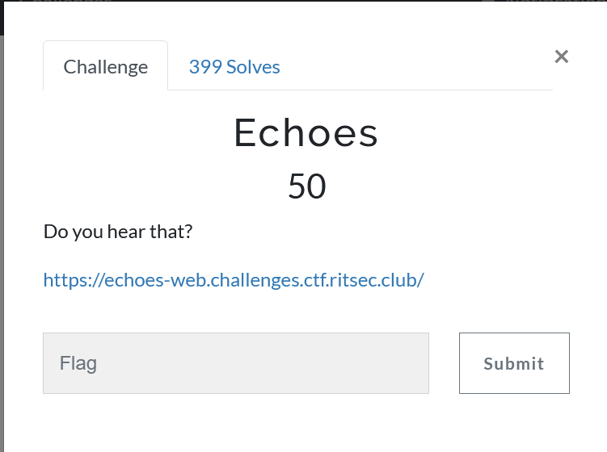
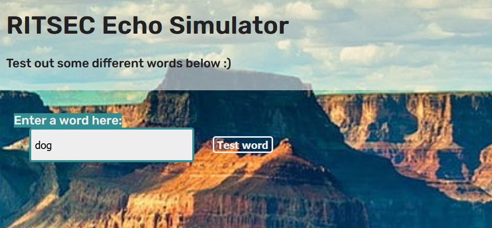
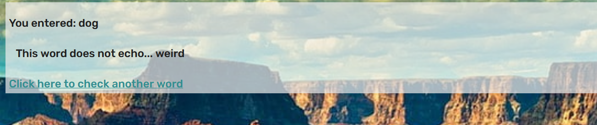
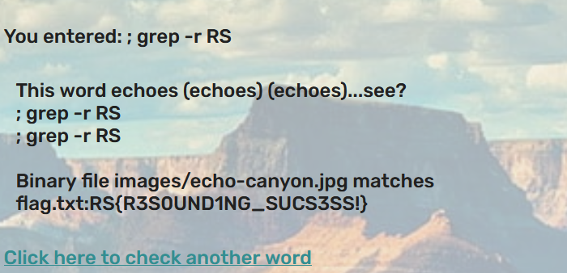

Upon opening website, we see this prompt.

As a sample query, I used the word `dog`. The result after hitting `Test Word` is:

Our input is output back to us.

Based on the name of the challenge, we can assume that the backend of the webapp is running `echo <user input>` and displaying the output on the webpage.

This means we can use command injection as our input is blindly trusted and run.

I know the flag format is `RS{}`. Using a semicolon, I can break out of the echo command and run my own command. Using this I can craft this payload and get the flag: `; grep -r RS #`

Flag: `RS{R3S0UND1NG_SUCS3SS!}`
