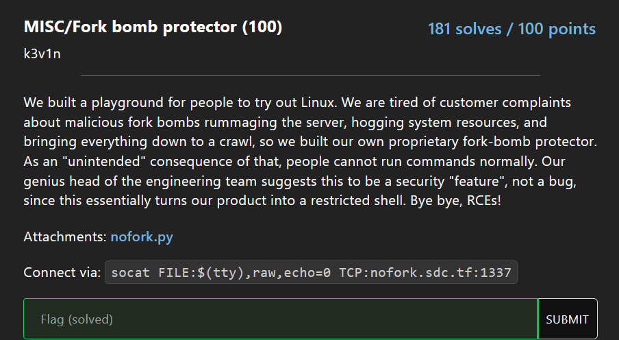
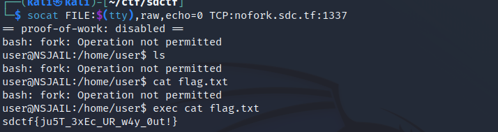

# Fork Bomb Protector



This is an easy but imo very good CTF challenge.

Here is the file running on the server, `nofork.py`:

```py
#! /usr/bin/env python3
import os
from seccomp import SyscallFilter, ALLOW, ERRNO
from errno import EPERM

FORBID = ERRNO(EPERM)

# Ban all fork-related syscalls to prevent fork bombs
def init_seccomp():
    f = SyscallFilter(defaction=ALLOW)

    f.add_rule(FORBID, "fork")
    f.add_rule(FORBID, "vfork")
    f.add_rule(FORBID, "clone")

    f.load()

init_seccomp()
os.execvp('bash', ['bash'])
```

So it looks like we cannot fork() stuff. If you sort of know how shells work at a basic level, it takes in your input and creates a process (using fork) for the program you are trying to run. The shell then waits for this process to finish before returning control to you.

Based on this knowledge, we would need to think, ok so if the shell forks the process and the child runs the program, how would the child run the program?

This is done via the the `exec` command.

Here is the bash docuemtnation on the exec command: https://www.gnu.org/software/bash/manual/bash.html#index-exec

An excerpt from the docs is `it replaces the shell without creating a new process`. Ok cool, so we can just run anything we want via exec, but since it replaces the shell of the current process, the process will exit afterwards because there is no shell to return to.



Using this information, we can get the flag:

```
┌──(kali㉿kali)-[~/ctf/sdctf]
└─$ socat FILE:$(tty),raw,echo=0 TCP:nofork.sdc.tf:1337
== proof-of-work: disabled ==
bash: fork: Operation not permitted
user@NSJAIL:/home/user$ ls
bash: fork: Operation not permitted
user@NSJAIL:/home/user$ cat flag.txt
bash: fork: Operation not permitted
user@NSJAIL:/home/user$ exec cat flag.txt
sdctf{ju5T_3xEc_UR_w4y_0ut!}
```

Flag: `sdctf{ju5T_3xEc_UR_w4y_0ut!}`
