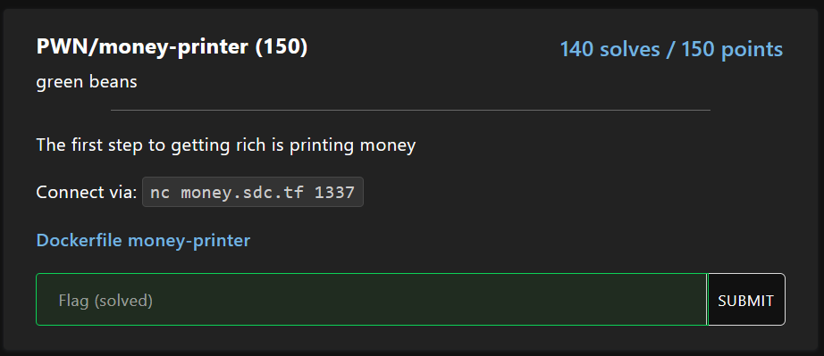
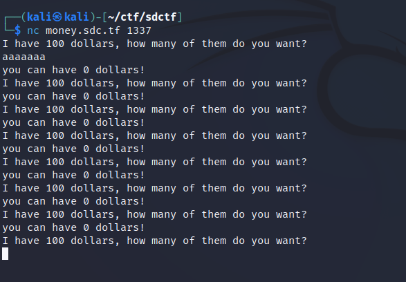
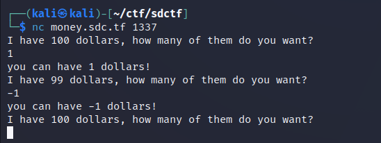
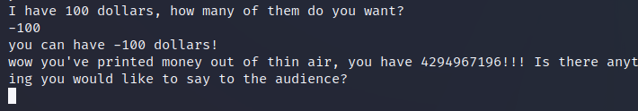
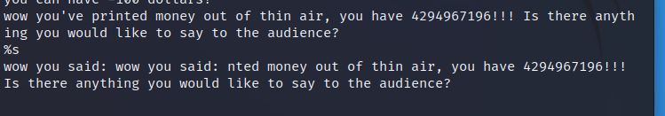

# Money Printer

Upon connecting to the service and entering random input:

Let's try entering a number:

Looks like if we enter negative numbers the server "gains" money. What if I enter a larger number:

Cool, looks like we got to this point. After playing around with this prompt for a while we can see there is a format string vulnerability.

Using this, we can use %p to leak data off of the stack. I did not decompile the binary but I will assume the flag has been loaded into memory and is lying somewhere on the stack.
