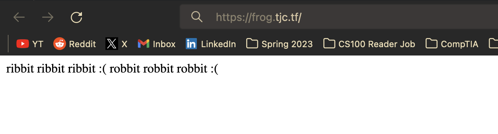

# Frogz

No source web challenge, 350 solves



There is nothing on the initial web page so I decided to fuzz, found endpoint `/robots.txt`.

Contents of robots.txt:

```
User-agent: *
Disallow: /secret-frogger-78570618/
```

Source content of `https://frog.tjc.tf/secret-frogger-78570618/` contains:


```html
<a href="flag-ed8f2331.txt" style="text-decoration: none;">🐸</a>🐸🐸🐸🐸🐸🐸🐸🐸
```

`https://frog.tjc.tf/secret-frogger-78570618/flag-ed8f2331.txt` contains flag:

`tjctf{fr0gg3r_1_h4rdly_kn0w_h3r_3e1c574f}`