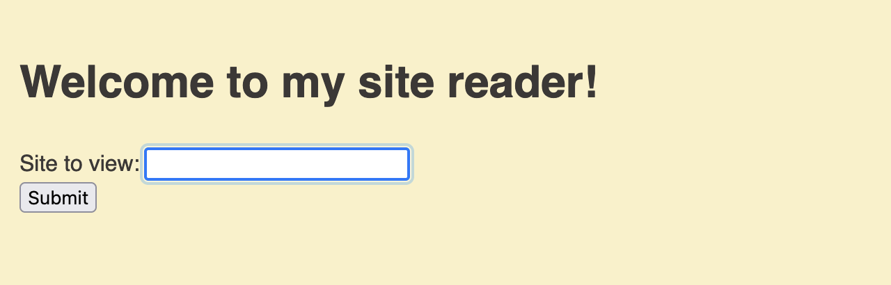

# Reader

Web challenge, 180 solves

We are given the source (See `server`) folder of a flask application.

Looking at the webapp itself, we see this:



There were a few suspicious things in the source code that we can overlook, as our goal is to get the flag. Looking at the server code, we see this route:

```
@app.route("/monitor")
def monitor():
    if request.remote_addr in ("localhost", "127.0.0.1"):
        return render_template(
            "admin.html", message=flag, errors="".join(log) or "No recent errors"
        )
    else:
        return render_template("admin.html", message="Unauthorized access", errors="")
```

So looks like a request to `/monitor` from the server itself will net us the flag. How can we make the server make requests on our behalf?

Looking at the base route:

```
@app.route("/")
def index():
    global log, log_count
    site_to_visit = request.args.get("site") or ""
    url = urlparse(site_to_visit)
    if not site_to_visit:
        return render_template("index.html")
    else:
        parser = etree.HTMLParser()
        try:
            response = get(site_to_visit).text
            tree = etree.fromstring(response, parser).getroottree()
            content = get_text_repr(tree, url.scheme + "://" + url.netloc)
        except Exception as e:
            print(e)
            log_count += 1
            if log_count >= MAX_LOGS:
                log.pop(0)
                log_count = MAX_LOGS
            log.append(str(e))
            tree = etree.fromstring(
                "<body>failed to load page</body>", parser
            ).getroottree()
            content = get_text_repr(tree, "")

        return render_template("site_view.html", content=content)
```

and the import `from requests import get`, we see that our input is taken in, the server checks if it is a url, and if so a request is made and the page is displayed. The server is making this request, so if we request the monitor endpoint, we can get the flag.


Looking at the Dockerfile included in the source code, we can get the source port:

```
CMD ["gunicorn", "-b", "0.0.0.0:5000", "app:app", "-w", "4"]
```

Thus if we ask the server to request `http://localhost:5000/monitor`, we will get the contents of the monitor endpoint returned to us after it has been requested by the server.

With the request `https://reader.tjc.tf/?site=http://localhost:5000/monitor` we get the flag:

`tjctf{maybe_dont_make_random_server_side_requests_dd695b62}`