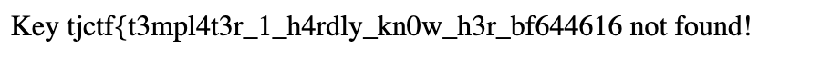

# Templater

Web challenge, 100 solves. The description is:

```
arghhhhhhhh jinja is so hard and bulky :(((
```

This is referring to jinja2, the templating language often used alongside flask.

Looking at the source code provided, we can see some interesting things:

```py
flag = open('flag.txt').read().strip()

template_keys = {
    'flag': flag,
    'title': 'my website',
    'content': 'Hello, {{name}}!',
    'name': 'player'
}
```

So the flag is put into this dictionary `template_keys`...

```py
@app.route('/add', methods=['POST'])
def add_template_key():
    key = request.form['key']
    value = request.form['value']
    template_keys[key] = value
    return redirect('/?msg=Key+added!')
```

We can add something to this dictionary (including the ability to clobber values)

```py
@app.route('/template', methods=['POST'])
def template_route():
    s = request.form['template']
    
    s = template(s)

    if flag in s[0]:
        return 'No flag for you!', 403
    else:
        return s

def template(s):
    while True:
        m = re.match(r'.*({{.+?}}).*', s, re.DOTALL)
        if not m:
            break

        key = m.group(1)[2:-2]

        if key not in template_keys:
            return f'Key {key} not found!', 500

        s = s.replace(m.group(1), str(template_keys[key]))
```

And we also have the ability to render a template the way jinja would. We can see that the challenge website is trying to replicate jinja2 behavior.

The vulnerability here comes in that we can still use original jinja2 functionality with a carefully crafted input.

Note the while loop behavior of the template function, each time it runs it looks for something that matches `` and replaces it with something from template keys. If the flag is found in the input after the template function is called, the output will not be shown to use, instead the message "No flag for you" would be shown. Thus, we need to get our output before that.

How can we do that? We can use the error in the template function to our advantage. Say that our input is `{{flag}}`, this is replaced by the flag. Now the function ends and we cannot bypass the check. But what if we used the flag as an invalid key? So we did `{{{{flag}}}}`? The inner `{{flag}}` resolves to the flag, and the second `{{flag here}}`` hits the error and returns back to us.

Using the payload `{{{{flag}}}}` anywhere when sent to the template endpoint gets us the flag:



Flag: `tjctf{t3mpl4t3r_1_h4rdly_kn0w_h3r_bf644616}`

